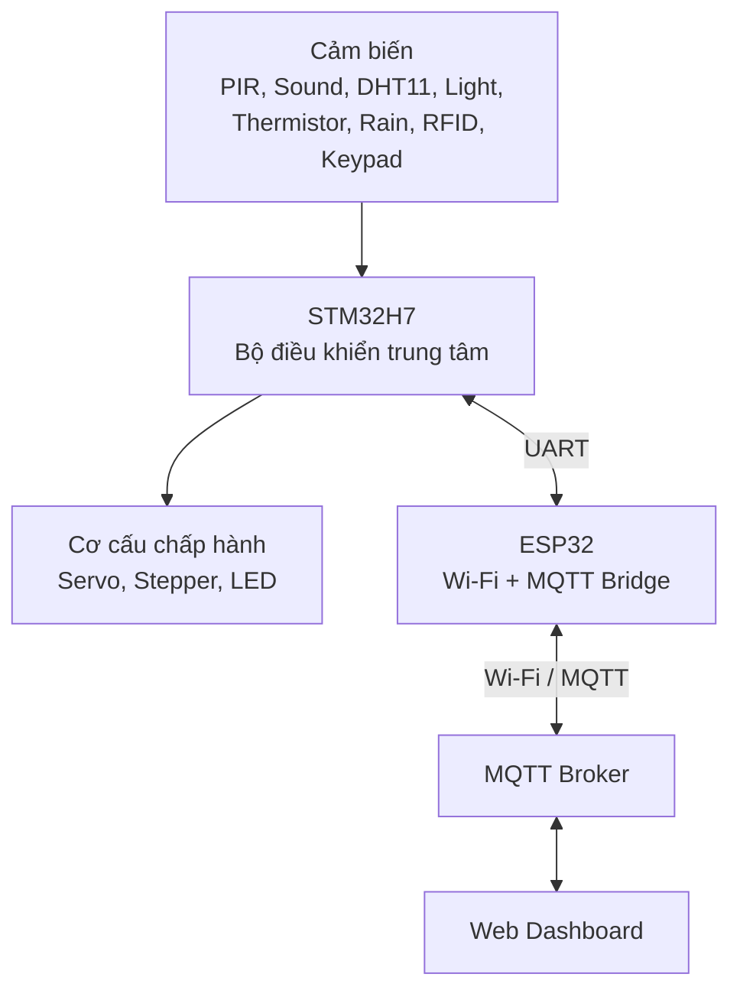

# SMART ROOM MONITORING AND SECURITY SYSTEM

> Hệ thống phòng thông minh sử dụng **STM32H7** làm bộ điều khiển trung tâm và **ESP32** làm cầu nối Wi-Fi/MQTT để giám sát, điều khiển từ xa qua Web Dashboard.

---

## 1. Giới thiệu

Đề tài xây dựng một hệ thống phòng thông minh tích hợp:

- Kiểm soát ra vào bằng **RFID hoặc mã PIN**.
- Điều khiển khóa cửa bằng **servo SG90**.
- Giám sát chuyển động và âm thanh để phát hiện xâm nhập.
- Tự động điều khiển đèn dựa trên chuyển động, ánh sáng và tiếng vỗ tay.
- Theo dõi nhiệt độ, độ ẩm và nhiệt độ cục bộ của thiết bị.
- Tự động mở cửa sổ để thông gió khi nóng hoặc ẩm.
- Tự động đóng cửa sổ khi phát hiện mưa.
- Hiển thị trạng thái bằng các LED được điều khiển qua **74HC595**.
- Gửi dữ liệu lên MQTT/Web Dashboard và nhận lệnh điều khiển từ xa qua **ESP32**.

Trong hệ thống:

- **STM32H7** chịu trách nhiệm đọc cảm biến, xử lý State Machine, kiểm tra điều kiện an toàn và điều khiển cơ cấu chấp hành.
- **ESP32** chịu trách nhiệm kết nối Wi-Fi, gửi dữ liệu lên MQTT/Web Dashboard và truyền lệnh từ Dashboard về STM32H7.
- Web/MQTT không điều khiển phần cứng trực tiếp. Mọi lệnh đều phải được STM32H7 kiểm tra trước khi thực hiện.

---

## 2. Kiến trúc tổng thể



### Luồng dữ liệu

```text
Cảm biến → STM32H7 → ESP32 → MQTT Broker → Web Dashboard
```

### Luồng điều khiển từ xa

```text
Web Dashboard → MQTT Broker → ESP32 → STM32H7 → Thiết bị
```

---

## 3. Chức năng chính

### 3.1. Kiểm soát ra vào

Người dùng có thể mở cửa bằng một trong hai phương thức:

1. Quét thẻ RFID hợp lệ.
2. Nhập đúng mã PIN trên keypad.

Chỉ cần một phương thức xác thực thành công:

```c
if (rfid_valid || pin_valid) {
    unlock_door();
}
```

STM32H7 điều khiển servo SG90 mở khóa, sau đó tự động khóa lại sau một khoảng thời gian.

Nếu quét sai thẻ hoặc nhập sai PIN nhiều lần, hệ thống tăng số lần xác thực thất bại và có thể chuyển sang trạng thái cảnh báo.

---

### 3.2. Home Mode

Home Mode là chế độ hoạt động bình thường khi người dùng đang ở trong phòng.

Trong chế độ này:

- PIR phát hiện sự hiện diện của người.
- Cảm biến ánh sáng xác định phòng sáng hay tối.
- DHT11 đo nhiệt độ và độ ẩm.
- Thermistor theo dõi nhiệt độ cục bộ của nguồn hoặc thiết bị.
- Cảm biến mưa theo dõi trạng thái thời tiết.
- Cảm biến âm thanh nhận biết số lần vỗ tay.
- Dữ liệu được gửi định kỳ lên Web Dashboard qua ESP32.

---

### 3.3. Điều khiển đèn tự động

Đèn tự động bật khi đồng thời thỏa mãn:

- Hệ thống đang ở Home Mode.
- PIR phát hiện có người.
- Cảm biến ánh sáng xác định môi trường tối.

```text
HOME MODE + Có người + Trời tối → Bật đèn
```

Nếu không còn phát hiện chuyển động trong khoảng thời gian cấu hình, hệ thống tự động tắt đèn.

---

### 3.4. Điều khiển đèn bằng tiếng vỗ tay

Chức năng này chỉ hoạt động trong Home Mode:

```text
Vỗ tay 2 lần → Tắt đèn
Vỗ tay 3 lần → Bật đèn
```

STM32H7 đếm số xung âm thanh trong một cửa sổ thời gian và sử dụng debounce để tránh một tiếng vỗ bị đếm thành nhiều lần.

Trong Security Mode và Alarm Mode, chức năng điều khiển bằng tiếng vỗ tay bị vô hiệu hóa.

---

### 3.5. Giám sát môi trường và thông gió

DHT11 đo nhiệt độ và độ ẩm chung của phòng.

Nếu:

- Hệ thống đang ở Home Mode.
- Nhiệt độ hoặc độ ẩm vượt ngưỡng.
- Không phát hiện mưa.
- Cửa sổ đang đóng.

STM32H7 điều khiển động cơ bước 28BYJ-48 thông qua ULN2003 để mở cửa sổ thông gió.

```text
HOME + Nóng/Ẩm + Không mưa → Mở cửa sổ
```

Thermistor được đặt gần nguồn, động cơ hoặc khu vực có nguy cơ quá nhiệt. Nếu nhiệt độ cục bộ vượt ngưỡng, hệ thống bật cảnh báo và gửi thông tin lên Dashboard.

---

### 3.6. Tự động đóng cửa sổ khi mưa

Nếu cảm biến mưa phát hiện nước và cửa sổ đang mở:

```text
Phát hiện mưa → Hủy thông gió → Đóng cửa sổ
```

Điều kiện mưa có độ ưu tiên cao hơn nhu cầu thông gió. Khi hết mưa, cửa sổ không tự động mở lại ngay mà chờ lệnh của người dùng hoặc điều kiện tự động mới.

---

### 3.7. Security Mode

Người dùng có thể kích hoạt Security Mode bằng:

- Nhấn phím chức năng trên keypad và nhập PIN xác nhận.
- Gửi lệnh từ Web Dashboard.

Trước khi vào Security Mode, hệ thống thực hiện tuần tự:

1. Đóng cửa sổ.
2. Tắt đèn.
3. Khóa cửa.
4. Chuyển PIR sang nhiệm vụ phát hiện xâm nhập.
5. Chuyển cảm biến âm thanh sang nhiệm vụ phát hiện âm thanh bất thường.
6. Gửi trạng thái mới lên Web Dashboard.

```text
Đóng cửa sổ → Tắt đèn → Khóa cửa → Bật giám sát → SECURITY MODE
```

---

### 3.8. Suspicious Mode

Khi Security Mode đang hoạt động và PIR phát hiện chuyển động, hệ thống chưa báo động ngay mà chuyển sang Suspicious Mode.

Người dùng có một khoảng thời gian để:

- Quét đúng RFID; hoặc
- Nhập đúng PIN.

Nếu xác thực thành công, Security Mode được tắt, cửa được mở và hệ thống trở về Home Mode.

Nếu không xác thực đúng trong thời gian cho phép, mức nguy hiểm tăng.

---

### 3.9. Đánh giá nguy cơ xâm nhập

Hệ thống có thể sử dụng điểm nguy hiểm:

| Sự kiện | Điểm gợi ý |
|---|---:|
| PIR phát hiện chuyển động | +1 |
| Phát hiện âm thanh lớn | +1 |
| Quét thẻ sai | +1 |
| Nhập PIN sai | +1 |
| Hết thời gian chờ xác thực | +2 |

Khi tổng điểm đạt ngưỡng cấu hình, hệ thống chuyển sang Alarm Mode.

---

### 3.10. Alarm Mode

Trong Alarm Mode, STM32H7 thực hiện đồng thời:

- Giữ cửa ở trạng thái khóa.
- Đóng cửa sổ bắt buộc.
- Tắt và khóa chức năng điều khiển đèn bằng tiếng vỗ tay.
- Từ chối lệnh mở cửa sổ từ Web.
- Điều khiển LED cảnh báo nhấp nháy qua 74HC595.
- Tiếp tục theo dõi PIR và cảm biến âm thanh.
- Gửi sự kiện cảnh báo lên MQTT/Web Dashboard.

Alarm Mode chỉ được hủy khi:

- Quét đúng RFID; hoặc
- Nhập đúng PIN trực tiếp tại thiết bị.

---

## 4. Thứ tự ưu tiên xử lý

Hệ thống sử dụng thứ tự ưu tiên để tránh xung đột giữa các lệnh:

| Mức ưu tiên | Điều kiện |
|---:|---|
| 1 | Alarm Mode |
| 2 | Security Mode |
| 3 | Phát hiện mưa |
| 4 | Phát hiện quá nhiệt |
| 5 | Nhu cầu thông gió |
| 6 | Lệnh điều khiển thông thường |

Ví dụ:

- Web yêu cầu mở cửa sổ nhưng đang mưa → từ chối lệnh.
- Nhiệt độ cao nhưng đang ở Security Mode → cửa sổ vẫn đóng.
- Có lệnh vỗ tay nhưng đang Alarm Mode → bỏ qua.
- PIR phát hiện người trong Home Mode và trời tối → bật đèn.

---

## 5. Phần cứng sử dụng

| STT | Linh kiện | Số lượng | Vai trò |
|---:|---|---:|---|
| 1 | STM32H7 | 1 | Bộ điều khiển trung tâm |
| 2 | ESP32 | 1 | Kết nối Wi-Fi, MQTT và Web |
| 3 | RFID RC522 | 1 | Xác thực thẻ |
| 4 | Keypad 4x4 | 1 | Nhập PIN và lệnh chức năng |
| 5 | Servo SG90 | 1 | Mô phỏng khóa cửa |
| 6 | PIR SR505 | 1 | Phát hiện chuyển động |
| 7 | Module cảm biến âm thanh | 1 | Đếm tiếng vỗ và phát hiện âm thanh lớn |
| 8 | DHT11 | 1 | Đo nhiệt độ và độ ẩm phòng |
| 9 | Cảm biến nhiệt điện trở | 1 | Phát hiện nhiệt độ cục bộ/quá nhiệt |
| 10 | Cảm biến ánh sáng | 1 | Đo mức sáng môi trường |
| 11 | Cảm biến mưa | 1 | Phát hiện mưa/nước |
| 12 | Động cơ bước 28BYJ-48 | 1 | Mở/đóng cửa sổ mô hình |
| 13 | ULN2003 | 1 | Driver cho động cơ bước |
| 14 | 74HC595 | 1 | Mở rộng đầu ra điều khiển LED |
| 15 | LED và điện trở hạn dòng | 8 | Hiển thị trạng thái |
| 16 | Nguồn 5 V riêng | 1 | Cấp nguồn servo và động cơ |
| 17 | Breadboard, dây nối | Theo nhu cầu | Lắp ráp hệ thống |

> **Lưu ý nguồn:** STM32H7 và RC522 sử dụng logic 3.3 V. Servo SG90 và động cơ bước nên dùng nguồn 5 V riêng. Tất cả các khối phải nối chung GND.

---

## 6. Giao tiếp giữa các thiết bị

| Thiết bị | Giao tiếp dự kiến |
|---|---|
| RC522 | SPI |
| ESP32 ↔ STM32H7 | UART |
| Servo SG90 | PWM từ Timer |
| Keypad 4x4 | GPIO Matrix Scan |
| PIR SR505 | GPIO/EXTI |
| Sound Sensor | GPIO/EXTI hoặc ADC |
| DHT11 | GPIO + Timer |
| Light Sensor | ADC |
| Thermistor | ADC |
| Rain Sensor | ADC hoặc Digital GPIO |
| 28BYJ-48 + ULN2003 | GPIO + Timer |
| 74HC595 | GPIO hoặc SPI |

---

## 7. Sơ đồ chân kết nối

> Cập nhật bảng này theo đúng chân đã cấu hình trong file `.ioc`.

| Module | Chân module | Chân STM32H7/ESP32 | Ghi chú |
|---|---|---|---|
| RC522 | SDA/SS | `<PIN>` | SPI Chip Select |
| RC522 | SCK | `<PIN>` | SPI Clock |
| RC522 | MOSI | `<PIN>` | SPI MOSI |
| RC522 | MISO | `<PIN>` | SPI MISO |
| RC522 | RST | `<PIN>` | Reset |
| Keypad | R1–R4 | `<PIN>` | GPIO Output |
| Keypad | C1–C4 | `<PIN>` | GPIO Input |
| Servo | PWM | `<PIN>` | Timer PWM |
| PIR | OUT | `<PIN>` | GPIO/EXTI |
| Sound | DO/AO | `<PIN>` | GPIO/ADC |
| DHT11 | DATA | `<PIN>` | GPIO |
| Light Sensor | AO | `<PIN>` | ADC |
| Thermistor | AO | `<PIN>` | ADC |
| Rain Sensor | AO/DO | `<PIN>` | ADC/GPIO |
| ULN2003 | IN1–IN4 | `<PIN>` | Stepper control |
| 74HC595 | DATA | `<PIN>` | Serial Data |
| 74HC595 | CLOCK | `<PIN>` | Shift Clock |
| 74HC595 | LATCH | `<PIN>` | Storage Clock |
| ESP32 UART | TX/RX | `<PIN>` | Giao tiếp với STM32H7 |

---

## 8. Cấu trúc phần mềm

```text
.
├── firmware/
│   ├── stm32h7/
│   │   ├── Core/
│   │   │   ├── Inc/
│   │   │   └── Src/
│   │   ├── App/
│   │   │   ├── system_manager.c
│   │   │   ├── access_control.c
│   │   │   ├── security_manager.c
│   │   │   ├── lighting_manager.c
│   │   │   ├── environment_manager.c
│   │   │   ├── window_manager.c
│   │   │   ├── indicator_manager.c
│   │   │   └── communication_manager.c
│   │   ├── Drivers/
│   │   │   ├── rc522.c
│   │   │   ├── keypad.c
│   │   │   ├── servo.c
│   │   │   ├── pir.c
│   │   │   ├── sound_sensor.c
│   │   │   ├── dht11.c
│   │   │   ├── analog_sensors.c
│   │   │   ├── stepper.c
│   │   │   └── hc595.c
│   │   └── SmartRoom.ioc
│   │
│   └── esp32/
│       ├── src/
│       │   ├── main.cpp
│       │   ├── wifi_manager.cpp
│       │   ├── mqtt_manager.cpp
│       │   ├── uart_bridge.cpp
│       │   ├── payload_parser.cpp
│       │   └── command_handler.cpp
│       ├── include/
│       ├── platformio.ini
│       └── secrets.example.h
│
├── web/
│   └── dashboard/
│
├── docs/
│   ├── architecture/
│   ├── circuit/
│   ├── flowcharts/
│   └── screenshots/
│
├── tests/
├── .gitignore
└── README.md
```

---

## 9. Các module phần mềm chính

### 9.1. `system_manager`

- Quản lý trạng thái toàn hệ thống.
- Chuyển đổi giữa Home, Security, Suspicious và Alarm.
- Áp dụng thứ tự ưu tiên.
- Điều phối các module còn lại.

```c
typedef enum {
    SYSTEM_INIT,
    HOME_MODE,
    ARMING_MODE,
    SECURITY_MODE,
    SUSPICIOUS_MODE,
    ALARM_MODE
} SystemState;
```

### 9.2. `access_control`

- Đọc RFID.
- Nhận PIN từ keypad.
- Kiểm tra điều kiện `RFID hợp lệ OR PIN hợp lệ`.
- Đếm số lần xác thực sai.
- Điều khiển mở/khóa cửa qua servo.

### 9.3. `security_manager`

- Nhận sự kiện từ PIR và cảm biến âm thanh.
- Quản lý thời gian chờ xác thực.
- Tính điểm nguy hiểm.
- Kích hoạt và hủy Alarm Mode.

### 9.4. `lighting_manager`

- Kết hợp PIR và cảm biến ánh sáng.
- Tự động bật/tắt đèn.
- Nhận lệnh vỗ tay:
  - 2 lần: tắt đèn.
  - 3 lần: bật đèn.
- Nhận lệnh điều khiển từ Web.
- Khóa điều khiển khi Security/Alarm yêu cầu.

### 9.5. `environment_manager`

- Đọc DHT11.
- Đọc cảm biến ánh sáng và thermistor qua ADC.
- So sánh dữ liệu với ngưỡng cấu hình.
- Phát hiện nóng, ẩm cao hoặc quá nhiệt.
- Gửi dữ liệu môi trường sang ESP32.

### 9.6. `window_manager`

- Theo dõi trạng thái cửa sổ.
- Điều khiển động cơ bước qua ULN2003.
- Mở cửa sổ khi cần thông gió.
- Đóng cửa sổ khi mưa, Security Mode hoặc Alarm Mode.
- Từ chối lệnh không an toàn từ Web.

### 9.7. `indicator_manager`

- Điều khiển 74HC595.
- Hiển thị trạng thái bằng LED.
- Nhấp nháy LED cảnh báo theo từng loại sự kiện.

### 9.8. `communication_manager`

- Giao tiếp UART giữa STM32H7 và ESP32.
- Đóng gói dữ liệu trạng thái.
- Phân tích lệnh từ ESP32.
- Gửi phản hồi thực hiện hoặc từ chối lệnh.

### 9.9. `wifi_manager`

- Kết nối và tự động kết nối lại Wi-Fi.
- Báo trạng thái Wi-Fi cho module MQTT.

### 9.10. `mqtt_manager`

- Kết nối MQTT Broker.
- Publish dữ liệu cảm biến và sự kiện.
- Subscribe các topic điều khiển.
- Tự động reconnect khi mất kết nối.

### 9.11. `uart_bridge`

- Nhận dữ liệu UART từ STM32H7.
- Chuyển dữ liệu thành payload MQTT.
- Nhận lệnh MQTT và gửi lệnh tương ứng về STM32H7.

---

## 10. MQTT Topics

### Topic trạng thái

| Topic | Chức năng |
|---|---|
| `smartroom/status/system` | Trạng thái online và mode |
| `smartroom/status/door` | Trạng thái cửa |
| `smartroom/status/window` | Trạng thái cửa sổ |
| `smartroom/status/light` | Trạng thái đèn |
| `smartroom/status/alarm` | Trạng thái cảnh báo |
| `smartroom/status/motion` | Trạng thái PIR |
| `smartroom/status/rain` | Trạng thái mưa |

### Topic cảm biến

| Topic | Dữ liệu |
|---|---|
| `smartroom/sensor/temperature` | Nhiệt độ phòng |
| `smartroom/sensor/humidity` | Độ ẩm |
| `smartroom/sensor/device_temperature` | Nhiệt độ thiết bị |
| `smartroom/sensor/light_level` | Mức ánh sáng |
| `smartroom/sensor/sound_level` | Mức âm thanh |

### Topic điều khiển

| Topic | Payload |
|---|---|
| `smartroom/cmd/light` | `ON`, `OFF` |
| `smartroom/cmd/window` | `OPEN`, `CLOSE` |
| `smartroom/cmd/security` | `ON`, `OFF` |
| `smartroom/cmd/system` | `STATUS` |

### Topic sự kiện

| Topic | Ví dụ |
|---|---|
| `smartroom/event/access` | `RFID_GRANTED`, `PIN_DENIED` |
| `smartroom/event/warning` | `RAIN_DETECTED`, `OVERHEAT` |
| `smartroom/event/alarm` | `INTRUSION_ALERT` |
| `smartroom/event/command_result` | `ACCEPTED`, `REJECTED_RAIN` |

### Ví dụ payload JSON

```json
{
  "mode": "HOME",
  "door": "LOCKED",
  "window": "CLOSED",
  "light": "ON",
  "temperature": 29.0,
  "humidity": 70.0,
  "deviceTemperature": 35.0,
  "lightLevel": 42,
  "rain": false,
  "motion": true,
  "alarm": false
}
```

---

## 11. Giao thức UART STM32H7–ESP32

Có thể sử dụng chuỗi kết thúc bằng ký tự xuống dòng.

### STM32H7 gửi trạng thái

```text
STATUS,MODE=HOME,DOOR=LOCKED,WINDOW=CLOSED,LIGHT=ON
SENSOR,TEMP=29.0,HUM=70.0,DEVICE_TEMP=35.0,LIGHT_LEVEL=42
EVENT,TYPE=ACCESS_GRANTED,METHOD=RFID
EVENT,TYPE=RAIN_DETECTED
```

### ESP32 gửi lệnh

```text
CMD,LIGHT=ON
CMD,LIGHT=OFF
CMD,WINDOW=OPEN
CMD,WINDOW=CLOSE
CMD,SECURITY=ON
CMD,SECURITY=OFF
CMD,STATUS=GET
```

### STM32H7 phản hồi

```text
ACK,CMD=WINDOW_OPEN,RESULT=ACCEPTED
ACK,CMD=WINDOW_OPEN,RESULT=REJECTED,REASON=RAIN
ACK,CMD=LIGHT_ON,RESULT=REJECTED,REASON=ALARM_MODE
```

---

## 12. Công cụ và phiên bản

> **Bắt buộc cập nhật cột “Phiên bản đã dùng” đúng với máy phát triển trước khi nộp. Không để nguyên giá trị `<CẬP NHẬT>`.**

| Công cụ/Framework | Phiên bản đã dùng | Cách kiểm tra |
|---|---|---|
| STM32CubeIDE | `<CẬP NHẬT>` | `Help → About STM32CubeIDE` |
| STM32CubeMX | `<CẬP NHẬT>` | `Help → About` |
| STM32CubeH7 Firmware Package | `<CẬP NHẬT>` | `Help → Manage Embedded Software Packages` |
| ARM GCC Toolchain | `<CẬP NHẬT>` | Xem trong Build Console |
| ESP32 framework | `<Arduino/ESP-IDF>` | Kiểm tra cấu hình project |
| Arduino Core for ESP32 hoặc ESP-IDF | `<CẬP NHẬT>` | Xem `platformio.ini` hoặc `idf.py --version` |
| PlatformIO Core | `<CẬP NHẬT>` | `pio --version` |
| Visual Studio Code | `<CẬP NHẬT>` | `Help → About` |
| MQTT Broker | `<Mosquitto/HiveMQ/EMQX>` | Kiểm tra server |
| MQTT Client Library | `<CẬP NHẬT>` | Xem dependency ESP32 |
| Git | `<CẬP NHẬT>` | `git --version` |

Ví dụ với PlatformIO:

```bash
pio --version
pio pkg list
```

Ví dụ với Git:

```bash
git --version
```

---

## 13. Cài đặt và chạy project

### 13.1. Clone repository

```bash
git clone <GITHUB_REPOSITORY_URL>
cd <PROJECT_DIRECTORY>
```

---

### 13.2. Cài đặt firmware STM32H7

1. Cài STM32CubeIDE đúng phiên bản được ghi trong mục 12.
2. Mở STM32CubeIDE.
3. Chọn:

```text
File → Import → Existing Projects into Workspace
```

4. Chọn thư mục:

```text
firmware/stm32h7
```

5. Mở file `SmartRoom.ioc`.
6. Kiểm tra cấu hình clock và các peripheral:
   - GPIO.
   - ADC.
   - SPI.
   - UART.
   - Timer PWM.
   - Timer cho DHT11/Stepper.
   - EXTI nếu sử dụng ngắt.
7. Chọn **Generate Code** nếu cần.
8. Build project.
9. Kết nối ST-LINK với board STM32H7.
10. Chọn **Run** hoặc **Debug** để nạp chương trình.

---

### 13.3. Cài đặt firmware ESP32 bằng PlatformIO

1. Cài Visual Studio Code.
2. Cài extension PlatformIO IDE.
3. Mở thư mục:

```text
firmware/esp32
```

4. Sao chép file:

```text
include/secrets.example.h
```

thành:

```text
include/secrets.h
```

5. Cập nhật thông tin:

```cpp
#pragma once

#define WIFI_SSID       "YOUR_WIFI_SSID"
#define WIFI_PASSWORD   "YOUR_WIFI_PASSWORD"

#define MQTT_HOST       "YOUR_MQTT_BROKER"
#define MQTT_PORT       1883
#define MQTT_USERNAME   "YOUR_MQTT_USERNAME"
#define MQTT_PASSWORD   "YOUR_MQTT_PASSWORD"
```

6. Kiểm tra chân UART kết nối STM32H7.
7. Build:

```bash
pio run
```

8. Upload:

```bash
pio run --target upload
```

9. Mở Serial Monitor:

```bash
pio device monitor
```

> Không commit file `secrets.h` chứa Wi-Fi hoặc mật khẩu MQTT lên GitHub.

---

### 13.4. Cài MQTT Broker

Có thể dùng Mosquitto cục bộ hoặc một MQTT Broker khác.

Ví dụ chạy Mosquitto bằng Docker:

```bash
docker run -d \
  --name smartroom-mqtt \
  -p 1883:1883 \
  -p 9001:9001 \
  eclipse-mosquitto
```

Kiểm tra subscribe:

```bash
mosquitto_sub -h localhost -t "smartroom/#" -v
```

Gửi lệnh bật đèn:

```bash
mosquitto_pub -h localhost \
  -t "smartroom/cmd/light" \
  -m "ON"
```

---

### 13.5. Chạy Web Dashboard

> Cập nhật lệnh dưới đây theo công nghệ Web thực tế của nhóm.

```bash
cd web/dashboard
npm install
npm run dev
```

Cấu hình kết nối MQTT trong file môi trường:

```env
VITE_MQTT_URL=ws://localhost:9001
VITE_MQTT_USERNAME=
VITE_MQTT_PASSWORD=
```

---

## 14. Các tham số cấu hình

Các giá trị cần hiệu chỉnh theo mô hình thực tế:

| Tham số | Giá trị gợi ý | Ý nghĩa |
|---|---:|---|
| `DOOR_UNLOCK_TIME_MS` | 5000 ms | Thời gian mở khóa |
| `NO_MOTION_TIMEOUT_MS` | 30000 ms | Thời gian tắt đèn khi không có người |
| `CLAP_DEBOUNCE_MS` | 200 ms | Chống đếm lặp tiếng vỗ |
| `CLAP_WINDOW_MS` | 1200 ms | Khoảng thời gian đếm tiếng vỗ |
| `AUTH_TIMEOUT_MS` | 10000 ms | Thời gian chờ xác thực |
| `MAX_FAILED_ATTEMPTS` | 3 | Số lần xác thực sai tối đa |
| `RISK_ALARM_THRESHOLD` | 3 | Ngưỡng chuyển Alarm Mode |
| `TEMP_HIGH_C` | 30 °C | Ngưỡng nhiệt độ cao |
| `HUMIDITY_HIGH_PERCENT` | 80% | Ngưỡng độ ẩm cao |
| `DEVICE_OVERHEAT_C` | 50 °C | Ngưỡng quá nhiệt cục bộ |
| `LIGHT_DARK_THRESHOLD` | `<CALIBRATE>` | Ngưỡng môi trường tối |
| `RAIN_THRESHOLD` | `<CALIBRATE>` | Ngưỡng phát hiện mưa |
| `SOUND_THRESHOLD` | `<CALIBRATE>` | Ngưỡng âm thanh bất thường |
| `STEPPER_OPEN_STEPS` | `<CALIBRATE>` | Số bước mở cửa sổ |
| `STEPPER_CLOSE_STEPS` | `<CALIBRATE>` | Số bước đóng cửa sổ |

---

## 15. Trình tự demo

### Demo 1: Khởi động

- Cấp nguồn.
- STM32H7 khởi tạo cảm biến.
- ESP32 kết nối Wi-Fi và MQTT.
- Servo khóa cửa.
- Dashboard hiển thị hệ thống online.

### Demo 2: Mở cửa hợp lệ

- Quét đúng RFID hoặc nhập đúng PIN.
- Servo mở khóa.
- Dashboard ghi nhận phương thức mở cửa.
- Sau thời gian cấu hình, cửa tự khóa lại.

### Demo 3: Đèn tự động

- Che cảm biến ánh sáng.
- Đi qua vùng phát hiện PIR.
- Đèn tự bật.
- Rời vùng PIR và chờ timeout.
- Đèn tự tắt.

### Demo 4: Điều khiển bằng vỗ tay

- Vỗ 2 lần: đèn tắt.
- Vỗ 3 lần: đèn bật.
- Dashboard cập nhật nguồn điều khiển.

### Demo 5: Thông gió và mưa

- Làm nhiệt độ/độ ẩm vượt ngưỡng.
- Hệ thống mở cửa sổ khi không mưa.
- Làm ướt cảm biến mưa.
- Hệ thống đóng cửa sổ và gửi cảnh báo.

### Demo 6: Security và Alarm

- Bật Security Mode.
- Hệ thống đóng cửa sổ, tắt đèn và khóa cửa.
- Kích hoạt PIR.
- Tạo âm thanh lớn.
- Không xác thực trong thời gian chờ.
- Alarm Mode được kích hoạt.
- Quét RFID đúng hoặc nhập PIN đúng để hủy cảnh báo.

### Demo 7: Điều khiển từ Web

- Bật/tắt đèn từ Dashboard.
- Mở/đóng cửa sổ từ Dashboard.
- Thử mở cửa sổ khi đang mưa.
- Xác nhận hệ thống từ chối lệnh không an toàn.

---

## 16. Kiểm thử

### Unit/Module Test

- Kiểm tra đọc RFID hợp lệ và không hợp lệ.
- Kiểm tra keypad và xác nhận PIN.
- Kiểm tra servo mở/khóa.
- Kiểm tra ngưỡng PIR, ánh sáng, mưa và nhiệt.
- Kiểm tra đếm 2 và 3 tiếng vỗ.
- Kiểm tra điều khiển stepper mở/đóng.
- Kiểm tra encode/decode dữ liệu UART.
- Kiểm tra publish/subscribe MQTT.

### Integration Test

| Test case | Kết quả mong đợi |
|---|---|
| RFID đúng | Cửa mở và Dashboard cập nhật |
| PIN đúng | Cửa mở và Dashboard cập nhật |
| RFID/PIN sai 3 lần | Cảnh báo được tạo |
| Home + PIR + tối | Đèn bật |
| 2 tiếng vỗ | Đèn tắt |
| 3 tiếng vỗ | Đèn bật |
| Home + nóng + không mưa | Cửa sổ mở |
| Đang mở cửa sổ + mưa | Cửa sổ đóng |
| Web mở cửa sổ khi mưa | Lệnh bị từ chối |
| Security + PIR + Sound + timeout | Alarm Mode |
| Alarm + RFID/PIN đúng | Hủy cảnh báo |

---

## 17. Trạng thái LED qua 74HC595

| LED | Trạng thái |
|---:|---|
| LED 1 | System Online |
| LED 2 | Home Mode |
| LED 3 | Security Mode |
| LED 4 | Door Unlocked |
| LED 5 | Motion Detected |
| LED 6 | Sound Detected |
| LED 7 | Rain Detected |
| LED 8 | Alarm Active |

---

## 18. Lưu ý an toàn và bảo mật

- Không cấp nguồn servo hoặc stepper trực tiếp từ chân 3.3 V của STM32.
- Sử dụng nguồn 5 V đủ dòng cho servo và động cơ bước.
- Nối chung GND giữa STM32H7, ESP32 và nguồn ngoài.
- Không đưa tín hiệu 5 V trực tiếp vào chân GPIO/ADC 3.3 V.
- Không commit Wi-Fi password, MQTT password hoặc PIN thật.
- Từ chối lệnh mở cửa sổ khi đang mưa, Security Mode hoặc Alarm Mode.
- Nên yêu cầu xác thực trực tiếp để hủy Alarm Mode.
- Debounce keypad, cảm biến âm thanh và các đầu vào số.
- Có timeout cho mọi trạng thái chờ để tránh treo hệ thống.
- Có cơ chế reconnect Wi-Fi/MQTT trên ESP32.
- STM32H7 vẫn phải hoạt động cục bộ khi ESP32 hoặc mạng bị mất kết nối.

---

## 19. Hình ảnh và tài liệu

Thêm các tài liệu sau vào thư mục `docs/`:

```text
docs/
├── architecture/system-architecture.png
├── circuit/wiring-diagram.png
├── flowcharts/state-machine.png
├── flowcharts/security-flow.png
├── screenshots/dashboard-home.png
├── screenshots/dashboard-alarm.png
└── demo/demo-video-link.txt
```

Trong README có thể chèn:

```markdown


```

---

## 20. Nhóm thực hiện

| Họ và tên | MSSV | Nhiệm vụ |
|---|---|---|
| `<THÀNH VIÊN 1>` | `<MSSV>` | STM32H7, State Machine |
| `<THÀNH VIÊN 2>` | `<MSSV>` | ESP32, MQTT |
| `<THÀNH VIÊN 3>` | `<MSSV>` | Web Dashboard |
| `<THÀNH VIÊN 4>` | `<MSSV>` | Phần cứng, kiểm thử |

---

## 21. Tiến độ hiện tại

- [ ] Hoàn thành sơ đồ khối.
- [ ] Hoàn thành sơ đồ chân.
- [ ] Đọc toàn bộ cảm biến trên STM32H7.
- [ ] Điều khiển servo.
- [ ] Điều khiển stepper qua ULN2003.
- [ ] Hoàn thành 74HC595 và LED trạng thái.
- [ ] Hoàn thành State Machine.
- [ ] Giao tiếp UART STM32H7–ESP32.
- [ ] Kết nối Wi-Fi và MQTT.
- [ ] Hoàn thành Web Dashboard.
- [ ] Kiểm thử tích hợp.
- [ ] Quay video demo.
- [ ] Cập nhật phiên bản công cụ trong README.

---

## 22. License

Project được phát triển phục vụ mục đích học tập trong môn Hệ nhúng.
